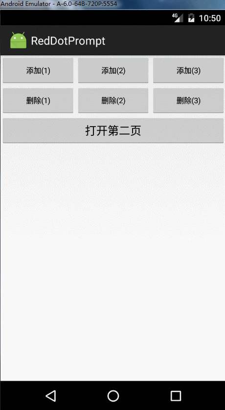
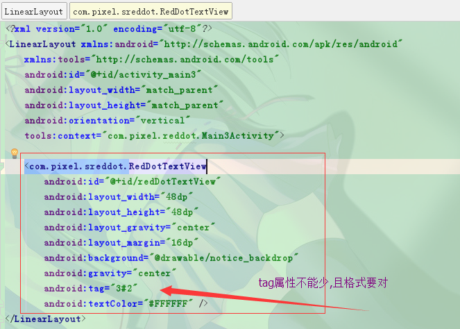
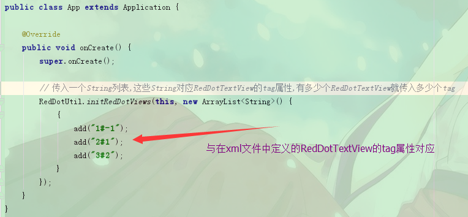
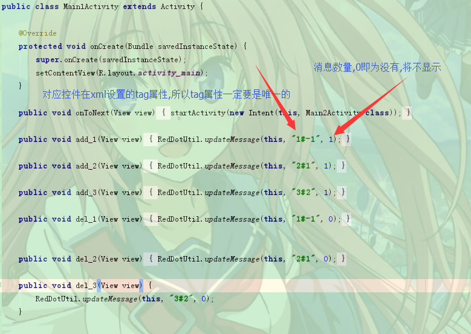

# RedDotPrompt
具有层级关系的小红点提示支持库,自己维护层级关系,子级有消息,父级也会出现提示,父级的消息数量是自己的消息数量与所有子级消息数量的总和.消息的更新全部可以通过静态方法更新.

## 效果演示

## 开始使用
### 在需要小红点提示的布局文件中加入控件.tag属性的格式是:"${自己ID}#S{父级ID}".如:"1#-1",1代表自己的ID,-1代表没有父级.格式一定要正确,最好使用int类型.tag属性一定不能为空.

### 在你的Application对象里初始化你项目中的所有小红点(RedDotTextView)的tag属性.这个主要是生成红点之间的层级关系,如果你的项目中红点的层级不超过2层可以不初始化.

### 更新小红点的消息可以调用静态方法RedDotUtil.updateMessage();

